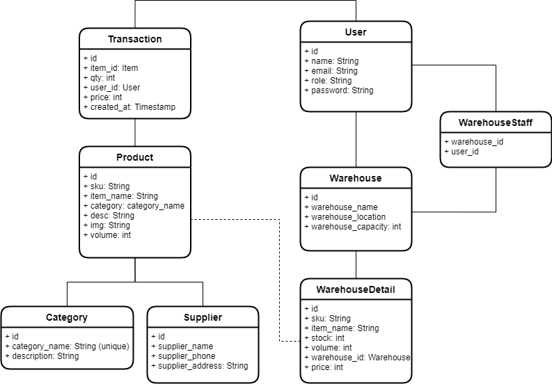

# Warehouse Management System

## Instruction

### Pull

1. Clone repository ini
2. Copy file `.env.example` ke `.env`
3. Run `php artisan migrate:fresh`
4. Run `git checkout -b nama`
5. Cari file yang harus diedit: `ctrl + shift + f` > masukin `Nama` > edit file

### Push

1. Run `git add .`
2. Run `git commit -m "Commit Message"`
3. Run `git push origin nama`

### Pembagian Tugas

| Nama    | Task                    |
| ------- | ----------------------- |
| cantika | Suppliers               |
| fildzah | Categories              |
| dede    | Warehouse               |
| hisyam  | Products, Profile       |
| ghufron | Dashboard, Transactions |

## Tasks

1. Edit file migrations di folder `/database/migrations`
2. Edit file model di folder `/app/Models`
3. Edit file view di folder `/resources/views/` & `/resource/views/forms`
4. Edit file di folder `/routes`
5. Edit file controller di folder `/app/Htpp/Controllers`

### ERD

_Ga harus 100% sama kayak ERD, boleh ditambah / dikurang._

### Penjelasan

-   `Manager` dapat melakukan semua hal yang dilakukan oleh `Staff`
-   `Manager` dapat menambahkan `Staff` ke `Warehouse`
-   Satu `Warehouse` bisa punya banyak `Staff`
-   Satu `Staff` bisa punya banyak `Warehouse`
-   Satu `Product` punya satu `Category`
-   Satu `Product` punya satu `Supplier`
-   Satu `Transaction` punya satu `Product`
-   Satu `Transaction` ada dua jenis `Inbound` dan `Outbound`
-   Satu `Transaction` punya satu `Warehouse`

### Mekanisme

1. Input `Category`
2. Input `Supplier`
3. Input `Product` (butuh data category, supplier)
4. Input `Transaction` (butuh data product)
